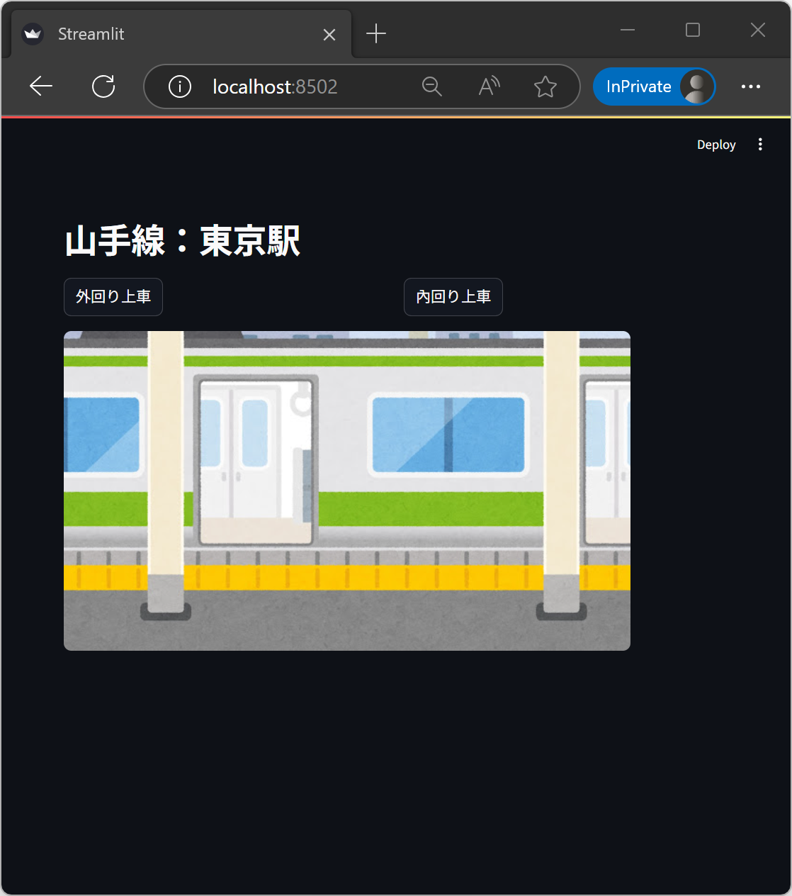
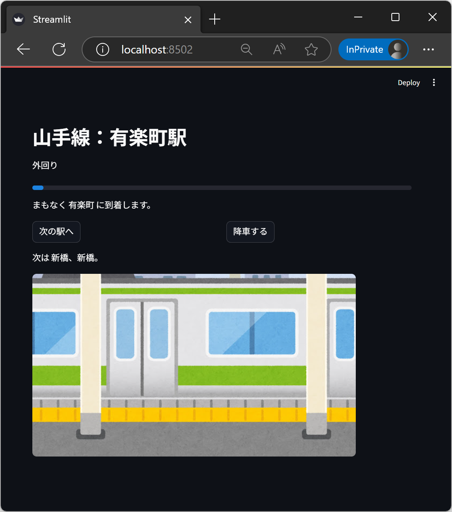
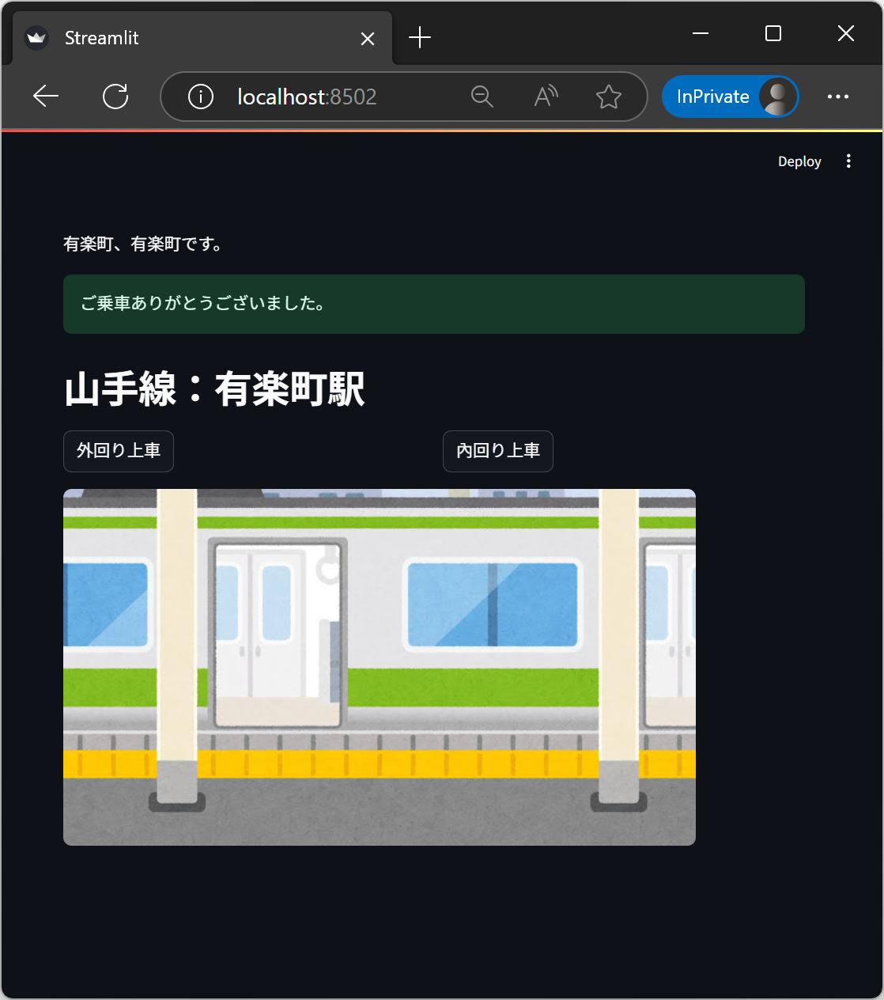

# 山手線シミュレーション
- Python研修のの空いた時間に作った
- 条件：特定コマンド入力まで続く、日常にあるものを再現
---
## 乗車前画面 （開始画面）

### 表示
- タイトル：現在の駅
- 画像：ドアが開いている

### 選択肢：路線を選ぶ
- 外回り上車：乗車中画面へ（東京 → 有楽町）
- 內回り上車：乗車中画面へ（東京 → 神田）

## 乗車中画面

### 表示
- タイトル：現在の駅
- 外回り/內回り
- 搭乗進捗（n/30）
- まもなく {現在の駅} に到着します。
- 次は {次の駅} 。
- 画像：ドアが閉まっている
  
### 選択肢：行動を選ぶ
- 次の駅へ
- 降車する：降車画面へ

## 降車画面

### 表示
-  {現在の駅} です。
- ご乗車ありがとうございました。
- タイトル：現在の駅
- 画像：ドアが開いている
  
### 選択肢：再上車路線を選ぶ
- 外回り上車：乗車中画面へ
- 內回り上車：乗車中画面へ